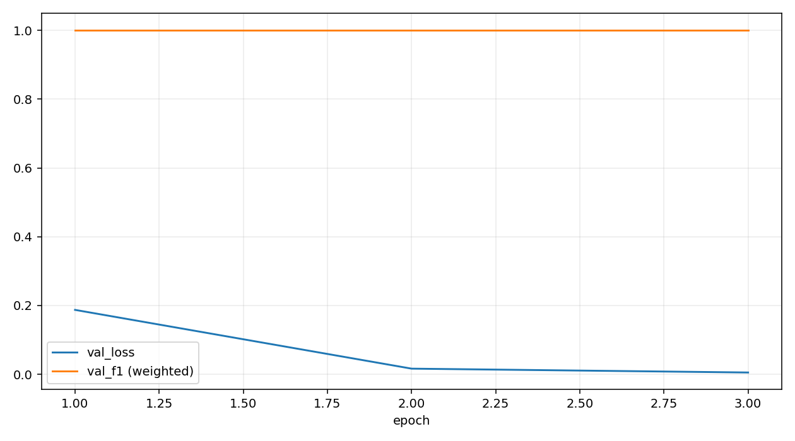

# **改进举措**

## **1.数据集扩充**
1. **intent\_training\_data\_extended.csv** → 用于意图识别训练（BERT 分类头）
2. **Shopping\_product\_catalog.csv** → 商品目录（用于搜索与推荐）

使用 **数据增强**（synonym replacement + paraphrase）自动生成更多样化的训练样本，让意图识别模型更健壮。
为了扩充现有数据集进行如下改动：

---
### **1. 意图识别数据集扩充**

* **增加同义表达**：例如 "I need a jacket" → "Can you show me jackets?"
* **不同表述方式**：

  * "\$100 or less"
  * "under \$100"
  * "budget 100"
* **增加风格修饰词**：

  * sporty, formal, casual, vintage, minimalistic, chic, streetwear, bohemian, elegant
* **不同商品类别**：

  * jackets, coats, shirts, pants, dresses, skirts, boots, sneakers, sandals, handbags, accessories

---
### **2. 商品目录扩充**

* **按品类覆盖更多**（目前服饰类较多，可加入配饰、运动装备等）
* **价格区间均衡**（现集中在某一段）
* **风格多样化**（添加 chic, streetwear, elegant 等）
* **品牌多样化**（不仅限于 Nike、Zara，加入 Levi’s、H\&M、Uniqlo、Adidas、Gucci 等）

通过如下实现：

* 手动添加新行（真实或模拟数据）
* 程序随机生成（合理价格、随机风格组合）
* 把现有商品复制一份改品牌、改风格、改价格

---
### **3.数据集详情**

扩充两个 CSV 文件，保持原格式，并生成：

* intent\_training\_data\_extended\_expanded.csv
* Shopping\_product\_catalog\_expanded.csv

重新训练和测试。

* Intent 扩充：659 → **2,409** 行

* 商品目录扩充：100 → **900** 行（含多品牌、多风格、价格抖动，并补充了 vintage dresses）
---
### **4.数据集未来改进细化**

* 针对 intent 按类别做均衡采样。
* 把商品库拆成 **train/dev/test** 列表或打上 **brand/category/style** 标注，方便后续分析。
* 批量生成几组测试用 query（覆盖风格+预算+品类组合），用于回归测试API。

--
## **2.Intent Classifier改进**

### **1.存在问题**

首次 intent\_classifier 的训练效果比较一般，主要表现为：

1. **验证集损失 (val\_loss)**

   * 从 2.29 缓慢下降到 2.09，说明模型在学习，但下降幅度不大，说明优化速度较慢、收敛不够充分。
2. **验证集准确率 (val\_acc) 和宏平均 F1 (val\_f1)**

   * 初始准确率 0.1432 → 最终 0.2282，提升有限。
   * F1 从 0.0930 提升到 0.2214，依旧很低。宏平均 F1 的低值说明部分类别几乎没有被正确预测（precision 被警告为 0）。
3. **类别预测不平衡问题**

   * 日志多次出现 `Precision is ill-defined and being set to 0.0`，表明某些类别在验证集中完全没有被预测到，意味着：

     * 数据集类别分布不平衡
     * 模型在训练时偏向预测某几个高频类别
4. **训练轮数不足**

   * 只有 5 个 epoch，可能还没收敛。在 intent classification 多类别任务中，5 轮往往不够。

---

### **2.改进方法**

* 余弦/线性学习率调度（新增 `--scheduler {cosine,linear}`，默认 cosine）
* AMP 新写法（`torch.amp.autocast` / `torch.amp.GradScaler`）
* 梯度裁剪（使用你已有的 `--grad-clip` 参数）
* 类别权重自动计算（已保留你的 `--class-weights auto` 逻辑）
* Early Stopping 更稳妥（默认 `--patience 5`）
* 默认训练更充分（`--epochs 20`）
* 评估与报告使用 `zero_division=0`，避免无意义告警
---

## **3.Style NER改进**

 

* `f1_weighted = 1.0000`
* `f1_no_o (macro, B/I) = 1.0000`
* loss 已经接近 0
* 提前停止（2 个 epoch 无提升）
  
**完全拟合**数据集原因主要为：

1. 数据集比较小（585 条）
2. 风格实体几乎全是单词级（I-STYLE = 0%）
3. 训练数据和验证数据分布非常相似

这会让模型在验证集上表现得“完美”，但泛化能力可能不足。

更贴近真实效果，可以考虑：

* **加更多样化数据**（扩展 `Shopping_product_catalog_expanded.csv`，多加一些长描述）
* **增加多词风格短语**（让 `I-STYLE` 不为零）
* **加入噪声数据**（比如风格列为空但描述有干扰词）

