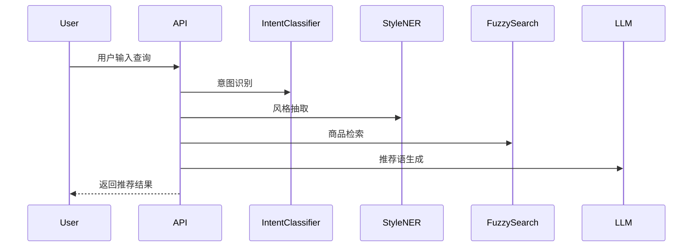

# AI 购物助手（AI Shopping Assistant）

本项目是一个轻量级的多任务 AI 导购系统，使用 **BERT** 与 **CRF** 实现：
- 用户意图识别（Intent Classification）
- 商品风格特征抽取（Style NER）

实现了一个基于 **BERT + CRF + Flask** 的轻量级 AI 导购系统，集成了**意图识别**与**商品风格特征抽取**两大核心功能，并通过模糊搜索与大语言模型生成自然化推荐语，适用于电商场景的智能推荐与交互。

---

## 1. 项目结构

```
ai-shopping-assistant/
├── config.py                         # 全局配置
├── requirement.txt                   # 依赖列表
├── api/
│   └── app.py                        # Fast API 入口
├── config/
│   └── search.yaml                   # 搜索配置
├── data/
│   ├── intent_training_data_extended.csv  # 意图训练数据
│   ├── ner_samples.json                   # NER 样例数据
│   ├── Shopping_product_catalog.csv       # 商品数据库
│   ├── style_train.json                   # 风格训练数据
│   ├── style_val.json                     # 风格验证数据
│   └── vocab.txt                          # 词汇表
├── models/
│   ├── __init__.py
│   ├── base_models.py                     # 模型基类
│   ├── integrated_system.py               # 集成调用系统
│   ├── intent_classifier.py               # 意图分类模型
│   ├── style_ner.py                       # 风格识别模型
│   ├── bert-base-uncased-style-ner/       # NER模型tokenizer
│   ├── bert-base-uncased/                 # BERTtokenizer和配置
│   ├── intent_classifier/                 # 意图分类器训练结果
│   └── style_ner/                         # 风格NER训练结果
└── tests/
    ├── test_environment.py                # 环境测试
    ├── test_intent_classifier.py          # 意图分类器测试
    ├── test_style_ner.py                  # 风格NER测试
    └── test_integration.py                # 系统集成测试
```

---

## 2. 环境安装

```bash
# 创建环境
conda create -n shopping-assistant python=3.12
conda activate shopping-assistant

# 安装PyTorch
conda install pytorch torchvision torchaudio pytorch-cuda=11.8 -c pytorch -c nvidia

# 安装核心依赖
pip install -r requirement.txt
```

---

## 3. 数据说明

- **intent_training_data_extended.csv**  
  包含用户查询与对应意图标签，用于意图分类训练。
- **style_train.json / style_val.json**  
  风格实体标注数据，BIO 格式。
- **Shopping_product_catalog.csv**  
  商品数据库，包含 `name`、`price`、`style`、`category` 等字段。
- **ner_samples.json**  
  测试用 NER 样例。
- **vocab.txt**  
  BERT 分词词表。

---

## 4. 核心模块与代码说明

### 4.1 `models/base_models.py`
定义模型基类，封装：
- `load_model()`：加载训练好的权重
- `save_model()`：保存当前权重
- `predict()`：推理接口

```python
class BaseModel:
    def load_model(self, path):
        self.model.load_state_dict(torch.load(path))
```

### 4.2 `models/intent_classifier.py`
BERT + 全连接层实现意图分类。

```python
class IntentClassifier(nn.Module):
    def __init__(self, num_labels):
        super().__init__()
        self.bert = BertModel.from_pretrained("bert-base-uncased")
        self.fc = nn.Linear(self.bert.config.hidden_size, num_labels)

    def forward(self, input_ids, attention_mask):
        outputs = self.bert(input_ids, attention_mask=attention_mask)
        pooled = outputs.pooler_output
        return self.fc(pooled)
```

### 4.3 `models/style_ner.py`
BERT + CRF 实现风格实体识别。

```python
class StyleNER(nn.Module):
    def __init__(self, num_labels):
        super().__init__()
        self.bert = BertModel.from_pretrained("bert-base-uncased")
        self.fc = nn.Linear(self.bert.config.hidden_size, num_labels)
        self.crf = CRF(num_labels, batch_first=True)

    def forward(self, input_ids, attention_mask, labels=None):
        logits = self.fc(self.bert(input_ids, attention_mask=attention_mask).last_hidden_state)
        if labels is not None:
            return -self.crf(logits, labels, mask=attention_mask.byte())
        else:
            return self.crf.decode(logits, mask=attention_mask.byte())
```

### 4.4 `models/integrated_system.py`
统一调用意图识别与风格NER，返回综合结果。

```python
def process_query(query):
    intent = intent_model.predict(query)
    styles = style_model.extract(query)
    products = product_searcher.search(styles)
    return {"intent": intent, "styles": styles, "products": products}
```

### 4.5 `api/app.py`
Flask API 入口。

```python
@app.route("/recommend", methods=["POST"])
def recommend():
    query = request.json.get("query")
    result = integrated_system.process_query(query)
    return jsonify(result)
```

---

## 5. 运行与调用

### 启动API
```bash
python api/app.py
```

### 调用接口
```bash
curl -X POST http://localhost:5000/recommend      -H "Content-Type: application/json"      -d '{"query":"推荐一款复古风格的连衣裙，500元以内"}'
```

---

## 6. 测试

运行全部测试：
```bash
pytest tests/
```

单独测试意图分类：
```bash
python tests/test_intent_classifier.py
```

---

## 7. 系统流程图



---

## 8. 优化方向

- 多轮对话：保存上下文，支持连续需求解析

- 多模态融合：结合商品图片进行风格判定

- 轻量化部署：蒸馏与量化以适配移动端

- 自学习：用户反馈驱动的模型持续优化